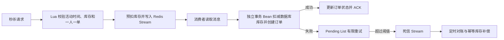

# HM-DP 本地生活点评与秒杀系统

基于 Spring Boot、MyBatis-Plus、MySQL、Redis、Redisson 和 Redis Stream 实现的本地生活服务后端。项目在原有点评、关注、签到、附近商户和优惠券功能上，重点补齐了秒杀异步下单的可靠性、缓存一致性、接口权限边界与工程化运行能力。

## 技术栈

- Java 8、Spring Boot 2.3、MyBatis-Plus
- MySQL、Redis、Redisson、Redis Stream、Lua
- Maven、JUnit 5、Mockito、Docker Compose

## 可靠秒杀链路



主要设计：

- 应用启动时自动创建 `stream.orders` 和消费组 `g1`。
- Lua 原子校验活动开始/结束时间、库存和一人一单，并记录 `PENDING` 状态。
- 消费线程调用独立事务 Bean，不依赖 `AopContext.currentProxy()`。
- 数据库事务成功且 Redis 状态更新成功后才 ACK；失败消息保留在 Pending List。
- 每条消息记录重试次数，超过阈值转入 `stream.orders.dlq`。
- `tb_voucher_order` 增加 `(user_id, voucher_id)` 唯一索引作为最终并发防线。
- 定时任务核对死信订单：数据库已有订单则修正状态，否则幂等归还 Redis 预扣库存。
- 秒杀接口返回订单 ID，客户端可轮询 `GET /voucher-order/status/{orderId}`。

## 缓存策略

店铺详情使用逻辑过期和 stale-while-revalidate：

- 首次未命中：Redisson 锁 + 双重检查，由锁持有者查询数据库并初始化缓存。
- 缓存未过期：直接返回。
- 逻辑过期：立即返回旧值，使用有界线程池异步重建。
- 重建失败：保留旧值并记录错误日志，避免缓存击穿。
- TTL 增加随机抖动，降低大量 Key 同时失效的风险。
- 店铺更新事务提交后删除缓存，避免提交前删缓存产生旧值回填。

## 权限边界

公开接口使用 `@PublicEndpoint` 显式标记，其余接口默认要求登录：

- 公开：登录验证码、登录、店铺/分类/优惠券/博客只读查询。
- 登录后：发布与点赞博客、关注、签到、秒杀、订单状态查询。
- 管理写操作：新增或修改店铺、发布优惠券、上传或删除图片，均不再匿名放行。

当前阶段只完成“公开/登录”边界，商户与平台管理员的完整 RBAC 是后续模块，不在简历中夸大为已完成。

## 快速启动

### Docker Compose

安装 Docker Desktop 后，在项目根目录执行：

```bash
docker compose up --build
```

Compose 会启动 MySQL、Redis 和应用，并在首次创建 MySQL 数据卷时导入 `src/main/resources/db/hmdp.sql`。默认访问地址为 `http://localhost:8081`。

如果已经存在旧数据卷且订单表没有唯一索引，需要手工执行：

```sql
ALTER TABLE tb_voucher_order
    ADD UNIQUE KEY uk_user_voucher (user_id, voucher_id);
```

迁移脚本位于 `src/main/resources/db/migration/V1__voucher_order_unique_index.sql`。

### 本地启动

1. 准备 MySQL 与 Redis，导入 `src/main/resources/db/hmdp.sql`。
2. 参考 `.env.example` 配置环境变量，不要把真实密码提交到 Git。
3. 执行：

```bash
mvn spring-boot:run
```

也可以参考 `application-example.yaml`，但真实密码应通过环境变量注入。

## 测试

```bash
mvn clean test
```

当前自动化测试覆盖：

- 秒杀订单事务的幂等处理、库存扣减和库存不足分支。
- 店铺缓存首次未命中时的数据库回源与逻辑缓存初始化。

依赖真实 MySQL/Redis 的数据预热测试已明确标记为手工集成测试，默认不会污染本机环境。

## 接口调试

- Postman 集合：`docs/hm-dp.postman_collection.json`
- 登录成功后，将返回的 token 放入请求头：`authorization: <token>`
- 秒杀成功返回订单 ID，随后轮询订单状态接口，直到状态不再是 `PENDING`。

## 配置安全

数据库密码、Redis 地址和密码、图片目录均通过环境变量配置。仓库忽略 `.env`、`application-local.yaml`、运行数据、IDE 文件、构建产物和个人文档。
